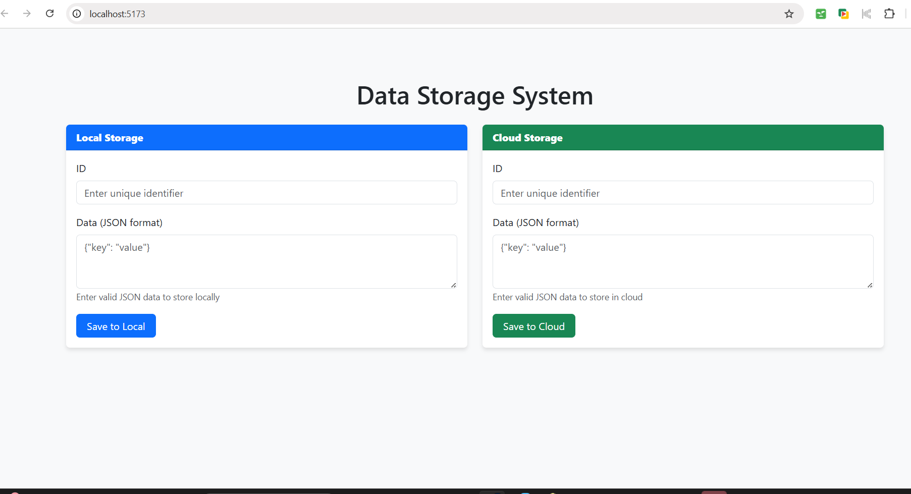

# Data Synchronization System



A configurable data synchronization system that maintains data between local and cloud storage with conflict resolution capabilities.

## Features

- **Bidirectional Synchronization**: Sync data between local and cloud storage
- **Conflict Resolution**: Automatically resolves conflicts based on last modified timestamp
- **Configurable Sync Direction**:
  - Local to Cloud only
  - Cloud to Local only
  - Bidirectional (both ways)
  - Cloud overwrites Local
- **Scheduled Sync**: Configure sync intervals using cron syntax
- **REST API**: Simple endpoints for managing data

[... rest of your existing README content ...]

## System Architecture

```
Frontend (React) → Backend (Node.js/Express) → MySQL Database
```

## Prerequisites

- Node.js (v16+ recommended)
- MySQL
- npm or yarn

## Installation

### Backend Setup

1. Navigate to backend directory:
```bash
cd backend
```

2. Install dependencies:
```bash
npm install
```

3. Create a MySQL database named `syncdb`

4. Configure database credentials in `sequelize.js`:
```javascript
const sequelize = new Sequelize('syncdb', 'your_username', 'your_password', {
  host: 'localhost',
  dialect: 'mysql'
});
```

5. Start the backend server:
```bash
npm start
```

### Frontend Setup

1. Navigate to frontend directory:
```bash
cd frontend
```

2. Install dependencies:
```bash
npm install
```

3. Start the development server:
```bash
npm run dev
```

## Configuration

Backend configuration can be modified in `config.js`:

```javascript
module.exports = {
  SYNC_CRON: '*/10 * * * * *', // Every 10 seconds
  SYNC_DIRECTION: 'bidirectional' // Options: 'bidirectional', 'local-to-cloud', 
                                 // 'cloud-to-local', 'cloud-overwrites-local'
};
```

## API Endpoints

### Local Data
- `POST /local` - Create/update local data
- `GET /local` - Get all local data

### Cloud Data
- `POST /cloud` - Create/update cloud data
- `GET /cloud` - Get all cloud data

### Configuration
- `GET /config` - Get current sync configuration
- `POST /config` - Update sync configuration

### Sync
- `POST /sync` - Trigger manual sync

## Usage

1. Access the frontend at `http://localhost:5173`
2. Use the interface to:
   - Add data to local or cloud storage
   - Configure sync settings
   - Trigger manual syncs
3. The system will automatically sync data based on your configuration

## Troubleshooting

### CORS Issues
If you encounter CORS errors:
1. Ensure the backend has CORS enabled (see `server.js`)
2. Or configure the Vite proxy (see `vite.config.js`)

### Database Connection Issues
Verify your MySQL credentials in `sequelize.js` and ensure the MySQL server is running

## Development

### Backend
- Uses Express.js with Sequelize ORM
- MySQL database
- Cron-based sync scheduler

### Frontend
- React with Vite
- React Bootstrap for UI components
- Axios for API calls

